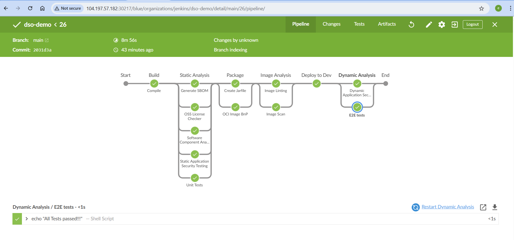
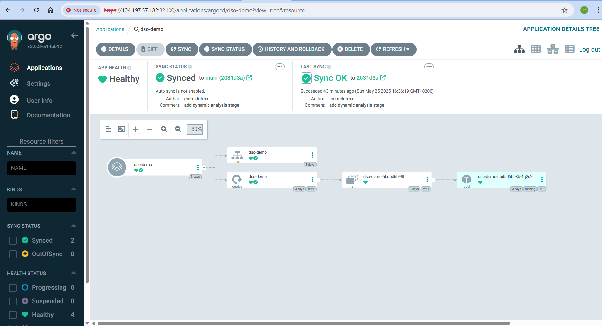
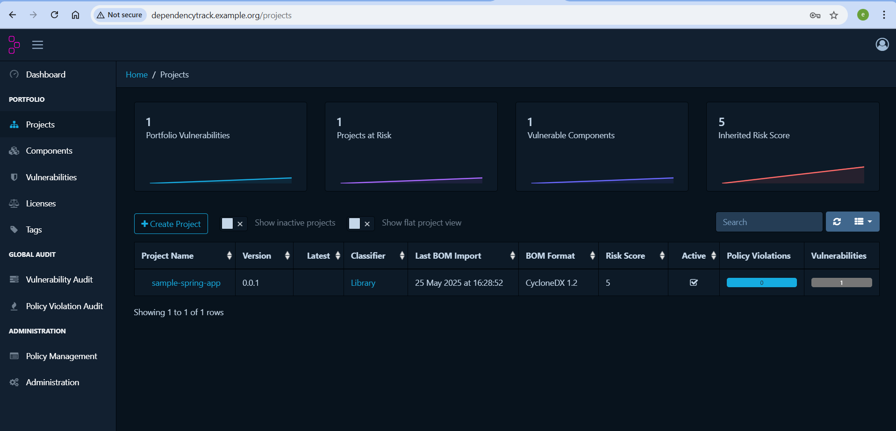

# DevSecOps CI/CD Pipeline on Kubernetes with Jenkins, Helm, and ArgoCD

## Overview

This project demonstrates as sample spring application with complete **DevSecOps workflow** built on top of a Kubernetes cluster using **Google Kubernetes Engine (GKE)**. It covers automated Continuous Integration (CI), security scanning, and Continuous Delivery (CD) using Jenkins pipeline and aaplication security best practices.

## Key Features

### Kubernetes Setup
- Provisioned a **GKE Cluster** on Google Cloud.
- Configured local `kubectl` and `gcloud` for secure cluster access.
- Installed and managed applications using **Helm**.

### Jenkins CI/CD Pipeline
- Installed Jenkins using Helm on Kubernetes.
- Configured pipelines with `Jenkinsfile` for automated builds.
- Used **Kaniko** for container image building and publishing (without Docker daemon).

### Jenkins setup

- Setup Jenkins server

  ```s
  helm repo add jenkins https://charts.jenkins.io
  helm repo update
  helm install jenkins jenkins/jenkins
  ```

- Wait for the jenkins pod to start
- Get admin user password of Jenkins

  ```s
    kubectl exec --namespace default -it svc/jenkins -c jenkins -- /bin/cat /run/secrets/chart-admin-password && echo
  ```

  **Note:** Make a note of the password

- Add additonal plugins to Jeninks server (Manage Jenkins -> Manage plugins)

  - BlueOcean
  - Configuration as Code
  - OWASP Dependency-Track

### Dependency Track setup

- Refer [Dependency Track v4 Installation Guide](DEPENDENCY_TRACK.md)

  **Note:** dependency-track will take some time to start (~1hr on low end Mac)

### Link Jenkins and Dependency Track

- Login to Dependency track -> Administration -> Access Management -> Teams -> Click on Automation -> Copy the API Keys -> Also add the Permissions - PROJECT_CREATION_UPLOAD, POLICY_VIOLATION_ANALYSIS, VULNERABILITY_ANALYSIS

- Login to Jenkins -> Manage Jenkins -> Configure System -> Scroll to bottom -> Configure the Dependency-Track URL and API key -> Also enable Auto Create Projects -> Test Connection -> Save

Hint: URL (if you have followed the exact steps) http://dependency-track-apiserver.dependency-track.svc.cluster.local

### Security Integration (DevSecOps)
- Integrated **OWASP Dependency-Check** for Software Component Analysis (SCA).
- Scanned open-source dependencies for license compliance and vulnerabilities.
- Generated a **Software Bill of Materials (SBOM)**.
- Used **Bandit** to analyze Python projects for security issues.
- Included **Spring Boot** dependency upgrades to fix CVEs.

### Container Image Hardening
- Used **Dockle** to lint container images for security best practices.
- Scanned images with **Trivy** to identify known vulnerabilities.
- Optimized Dockerfile using **multi-stage builds**.
- Added non-root user and health checks for secure container practices.

### Continuous Deployment with ArgoCD
- Installed and configured **ArgoCD** for GitOps-based deployments.
- Set up **CLI access and RBAC** to manage and secure ArgoCD.
- Configured Jenkins to **trigger ArgoCD deployments** automatically after successful builds.
- Deployed applications to Kubernetes using **generated manifests**.

## Tools & Technologies

| Category           | Tools / Platforms                    |
|--------------------|--------------------------------------|
| Cloud              | Google Cloud Platform (GKE)          |
| CI/CD              | Jenkins, Jenkinsfile, Kaniko         |
| GitOps/CD          | ArgoCD                               |
| Kubernetes         | GKE, Helm, kubectl                   |
| Security Scanning  | OWASP-Dependency-Check, Trivy, ZAP,  |
|                    | Dockle 				    |
| Programming        | Java (Spring Boot), Python           |
| Containerization   | Docker, Dockerfile (multi-stage)     |


Refer the below screenshot for the stages in the pipeline

##### Pipeline View



##### ArgCD Dashboard



##### Dependency Track



